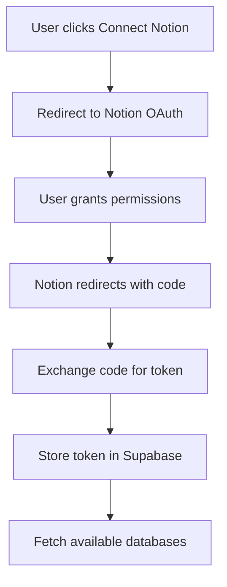
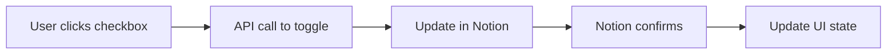
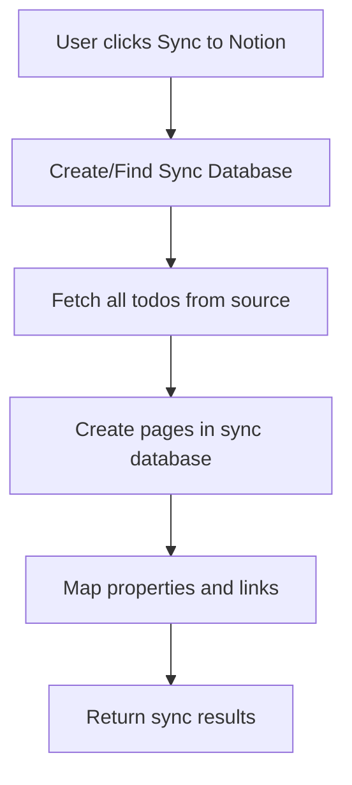

# Notion Integration Guide

This document provides comprehensive documentation on how Checkify.so integrates with Notion, including OAuth setup, API operations, and bidirectional synchronization.

## Overview

Checkify.so integrates deeply with Notion to:
- Fetch todo items from Notion databases and pages
- Sync checkbox states bidirectionally in real-time
- Maintain Notion as the single source of truth
- Support multiple Notion workspaces per user

## Notion OAuth Setup

### Prerequisites

1. Create a Notion integration:
   - Go to https://www.notion.so/my-integrations
   - Click "New integration"
   - Select "Public integration" type
   - Configure OAuth settings

2. OAuth Configuration:
   ```
   Redirect URI: https://your-domain.com/api/connect-notion
   Capabilities:
   - Read content
   - Update content
   - Read user information
   ```

3. Store credentials:
   ```env
   NOTION_CLIENT_ID=your_client_id
   NOTION_CLIENT_SECRET=your_client_secret
   ```

### OAuth Flow Implementation



#### 1. Initiate OAuth (`/components/app/ConnectNotion.vue`)

```typescript
const connectNotion = () => {
  const redirectUri = `${window.location.origin}/api/connect-notion`
  const authUrl = `https://api.notion.com/v1/oauth/authorize?client_id=${CLIENT_ID}&response_type=code&redirect_uri=${redirectUri}`
  
  window.location.href = authUrl
}
```

#### 2. Handle OAuth Callback (`/server/api/connect-notion.post.ts`)

```typescript
export default defineEventHandler(async (event) => {
  const { code } = getQuery(event)
  
  // Exchange code for access token
  const tokenResponse = await fetch('https://api.notion.com/v1/oauth/token', {
    method: 'POST',
    headers: {
      'Content-Type': 'application/json',
      'Authorization': `Basic ${Buffer.from(`${CLIENT_ID}:${CLIENT_SECRET}`).toString('base64')}`
    },
    body: JSON.stringify({
      grant_type: 'authorization_code',
      code,
      redirect_uri: REDIRECT_URI
    })
  })
  
  const tokenData = await tokenResponse.json()
  
  // Store token in database
  await adminClient.from('notion_access_token').insert({
    access_token: tokenData
  })
  
  // Link to user
  await adminClient.from('notion_access_token_user').insert({
    user_id: user.id,
    access_token: tokenData.access_token
  })
})
```

## Notion API Integration

### Client Initialization

The Notion client is initialized in API routes using the stored access token:

```typescript
// /server/api/notion/[endpoint].ts
import { Client } from '@notionhq/client'

const notion = new Client({
  auth: event.context.notionAccessToken
})
```

### Key API Operations

#### 1. Search Databases (`/server/api/search-notion.ts`)

```typescript
const response = await notion.search({
  filter: {
    value: 'database',
    property: 'object'
  },
  sort: {
    direction: 'descending',
    timestamp: 'last_edited_time'
  }
})

// Store database metadata
for (const database of response.results) {
  await adminClient.from('notion_database').upsert({
    notion_database_id: database.id,
    name: database.title[0]?.plain_text,
    metadata: database,
    access_token: notionAccessToken
  })
}
```

#### 2. Fetch Pages from Database (`/server/api/todo-list/index.post.ts`)

```typescript
// Query database for pages
const pages = await notion.databases.query({
  database_id: database_id,
  page_size: 60,
  sorts: [{
    timestamp: 'created_time',
    direction: 'descending'
  }]
})

// Process each page
for (const page of pages.results) {
  // Store page metadata
  await supabase.from('page').upsert({
    notion_block: page,
    block_text: getPageTitle(page),
    notion_block_id: page.id,
    notion_parent_id: page.parent.database_id,
    notion_created_time: page.created_time
  })
  
  // Fetch child blocks (todos)
  await fetchChildBlocks(page.id)
}
```

#### 3. Fetch Todo Blocks

```typescript
async function fetchChildBlocks(pageId: string) {
  const blocks = await notion.blocks.children.list({
    block_id: pageId,
    page_size: 100
  })
  
  for (const block of blocks.results) {
    if (block.type === 'to_do') {
      await supabase.from('todo').upsert({
        notion_block: block,
        block_text: block.to_do.rich_text[0]?.plain_text,
        notion_block_id: block.id,
        notion_page_id: pageId,
        checked: block.to_do.checked
      })
    }
    
    // Recursively fetch nested blocks
    if (block.has_children) {
      await fetchChildBlocks(block.id)
    }
  }
}
```

## Bidirectional Sync

### Checkbox Toggle Flow

The most critical feature is real-time checkbox synchronization:



#### Implementation (`/server/api/toggle-checkbox.post.ts`)

```typescript
export default defineEventHandler(async (event) => {
  const { block_id, checked } = await readBody(event)
  
  // Initialize Notion client
  const notion = new Client({
    auth: event.context.notionAccessToken
  })
  
  // Update the todo block in Notion
  const response = await notion.blocks.update({
    block_id,
    to_do: {
      checked: !checked // Toggle the state
    }
  })
  
  // Return updated state
  return {
    success: true,
    checked: response.to_do.checked
  }
})
```

### Frontend Integration (`/components/NotionBlock.vue`)

```vue
<script setup>
const toggleCheckbox = async (block) => {
  try {
    const { data } = await $fetch('/api/toggle-checkbox', {
      method: 'POST',
      body: {
        block_id: block.id,
        checked: block.to_do.checked
      }
    })
    
    // Update local state
    block.to_do.checked = data.checked
  } catch (error) {
    // Handle error, revert checkbox
    showToast('Failed to update checkbox')
  }
}
</script>
```

## Sync to Notion Database Feature

### Overview

The sync-to-Notion feature creates a centralized Notion database that aggregates all todos from various pages into a single, organized view. This solves the problem of todos being scattered across different Notion pages.

### How It Works



### Implementation Details

#### 1. Database Creation

The sync database includes these properties:
- **Title** (title) - The todo text
- **Status** (checkbox) - Completion status
- **Page** (rich_text) - Source page title
- **Page Link** (url) - Direct link to source page
- **Block Link** (url) - Direct link to specific todo
- **Last Updated** (last_edited_time) - Sync timestamp
- **Block ID** (rich_text) - Original block reference

#### 2. Sync Process (`/server/api/todo-list/sync-to-notion.post.ts`)

```typescript
// Create or update sync database
const syncDatabase = await createSyncDatabase(notion, parentPageId)

// Sync each todo
for (const todo of todos) {
  const pageData = {
    parent: { database_id: syncDatabase.id },
    properties: {
      Title: { title: [{ text: { content: todo.text } }] },
      Status: { checkbox: todo.checked },
      Page: { rich_text: [{ text: { content: todo.pageTitle } }] },
      'Page Link': { url: todo.pageUrl },
      'Block Link': { url: todo.blockUrl },
      'Block ID': { rich_text: [{ text: { content: todo.blockId } }] }
    }
  }
  
  await notion.pages.create(pageData)
}
```

#### 3. Update Tracking

- Sync database ID stored in `todo_list.notion_sync_database_id`
- Last sync date tracked in `todo_list.last_sync_date`
- Supports incremental updates on subsequent syncs

### User Experience

1. One-click sync from todo list dashboard
2. Progress indicators during sync
3. Direct link to created database
4. Sync results summary (created/updated/errors)

### Limitations

- **Forward-only sync**: Changes in sync database don't reflect back
- **Notion API limits**: Respects rate limiting
- **Tier-based limits**: Number of todos synced based on subscription

## Data Synchronization Strategy

### 1. Initial Extraction
When a user connects a database:
- Fetch all pages (respecting tier limits)
- Extract todo blocks from each page
- Store extraction metadata
- Display in UI with stats

### 2. Real-time Updates
For checkbox changes:
- Direct API call to Notion
- No local state caching
- Immediate visual feedback
- Error handling with rollback

### 3. Refresh Strategy
- Manual refresh button available
- Automatic refresh on navigation
- Planned: Automatic sync (Pro/Max tiers)

## Error Handling

### Common Notion API Errors

```typescript
try {
  const response = await notion.databases.query(...)
} catch (error) {
  if (error.code === 'object_not_found') {
    // Database was deleted or permissions revoked
    await removeDatabase(database_id)
  } else if (error.code === 'unauthorized') {
    // Token expired or revoked
    await promptReconnection()
  } else if (error.code === 'rate_limited') {
    // Too many requests
    await implementBackoff()
  }
}
```

### Rate Limiting

Notion API limits:
- 3 requests per second
- Implement exponential backoff
- Queue requests when necessary

```typescript
const rateLimiter = {
  queue: [],
  processing: false,
  
  async execute(fn) {
    this.queue.push(fn)
    if (!this.processing) {
      this.processQueue()
    }
  },
  
  async processQueue() {
    this.processing = true
    while (this.queue.length > 0) {
      const fn = this.queue.shift()
      await fn()
      await sleep(350) // ~3 req/sec
    }
    this.processing = false
  }
}
```

## Security Considerations

### 1. Token Storage
- Tokens encrypted in Supabase
- Never exposed to client
- Separate tokens per user
- Revocable at any time

### 2. Permission Scoping
- Only request necessary permissions
- Read/update content only
- No admin capabilities
- User controls database access

### 3. Data Privacy
- No data permanently stored
- Cache can be cleared
- User owns all data
- GDPR compliant

## Testing Notion Integration

### Mock Notion Client

```typescript
// tests/mocks/notion.ts
export const mockNotion = {
  databases: {
    query: vi.fn().mockResolvedValue({
      results: [mockPage]
    })
  },
  blocks: {
    update: vi.fn().mockResolvedValue({
      to_do: { checked: true }
    })
  }
}
```

### Integration Tests

```typescript
describe('Notion Integration', () => {
  it('should toggle checkbox state', async () => {
    const response = await $fetch('/api/toggle-checkbox', {
      method: 'POST',
      body: {
        block_id: 'test-block',
        checked: false
      }
    })
    
    expect(response.checked).toBe(true)
    expect(mockNotion.blocks.update).toHaveBeenCalled()
  })
})
```

## Notion URL Parser

### Purpose

The URL parser utility extracts Notion page IDs from various URL formats, handling the complexity of Notion's URL structures.

### Implementation (`/utils/notion-url-parser.ts`)

```typescript
export function extractNotionPageId(url: string): string | null {
  // Handle various Notion URL formats:
  // 1. https://notion.so/Page-Title-abc123
  // 2. https://notion.so/workspace/Page-Title-abc123
  // 3. https://notion.so/abc123
  // 4. https://www.notion.so/workspace/abc123?v=xyz
  
  const patterns = [
    /notion\.so\/(?:.*\/)?(\w{32})(?:\?|$)/,
    /notion\.so\/(?:.*\/)?([\w-]+)-(\w{32})(?:\?|$)/
  ]
  
  for (const pattern of patterns) {
    const match = url.match(pattern)
    if (match) {
      return match[match.length - 1]
    }
  }
  
  return null
}
```

### Supported URL Formats

- Direct page links
- Workspace-prefixed URLs
- URLs with query parameters
- URLs with view parameters
- Short links
- Full page title URLs

### Usage Example

```typescript
const pageId = extractNotionPageId('https://notion.so/My-Page-abc123def456')
// Returns: 'abc123def456'
```

## Troubleshooting

### Common Issues

1. **"Notion workspace not found"**
   - Ensure integration is installed in workspace
   - Check OAuth permissions
   - Verify workspace ID

2. **"Cannot read/update blocks"**
   - Page must be shared with integration
   - Check block permissions
   - Verify parent access

3. **"Rate limit exceeded"**
   - Implement request queuing
   - Add retry logic
   - Consider caching strategy

### Debug Mode

Enable Notion API debugging:
```typescript
const notion = new Client({
  auth: token,
  logLevel: LogLevel.DEBUG
})
```

## Best Practices

1. **Always handle errors gracefully**
   - Show user-friendly messages
   - Provide recovery options
   - Log errors for debugging

2. **Optimize API calls**
   - Batch operations when possible
   - Use pagination effectively
   - Cache when appropriate

3. **Respect rate limits**
   - Implement queuing
   - Add backoff strategies
   - Monitor usage patterns

4. **Maintain data integrity**
   - Notion as source of truth
   - No critical data in cache only
   - Handle sync conflicts

## Planned Features

### 1. Webhook Integration
- Real-time bidirectional sync
- Notion webhook subscriptions
- Instant updates from Notion changes
- Reduced API calls

### 2. Automatic Synchronization
- Scheduled sync for Pro/Max tiers
- Daily (Pro) or hourly (Max) updates
- Background job implementation
- Smart sync based on activity

### 3. Advanced Filtering
- Filter todos by properties
- Custom views and sorting
- Search across all todos
- Tag-based organization

### 4. Bulk Operations
- Mark multiple todos complete
- Bulk edit properties
- Mass organization tools
- Export capabilities