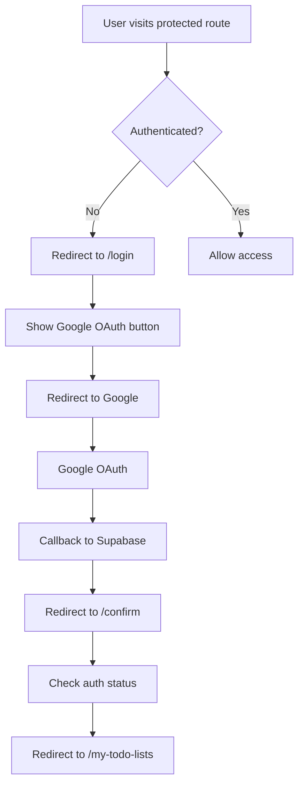

# Authentication Guide

*Last updated: January 2025*

This document details the authentication system in Checkify.so, including Supabase auth setup, session management, and route protection.

## Overview

Checkify.so uses a dual authentication system:
1. **Primary Auth**: Supabase Authentication with Google OAuth
2. **Secondary Auth**: Notion OAuth for API access

## Supabase Authentication

### Configuration

The Supabase module is configured in `nuxt.config.ts`:

```typescript
supabase: {
  redirectOptions: {
    login: '/login',
    callback: '/confirm',
    exclude: [
      '/',
      '/privacy-policy', 
      '/terms-of-use',
      '/checkboxes',
      '/todo-list/*',
      '/docs/*',
    ]
  }
}
```

### Authentication Flow



### Key Components

#### Login Page (`/pages/login.vue`)
```vue
<script setup>
const supabase = useSupabaseClient()

const signInWithGoogle = async () => {
  const { error } = await supabase.auth.signInWithOAuth({
    provider: 'google',
    options: {
      redirectTo: `${window.location.origin}/confirm`,
    },
  })
}
</script>
```

#### Confirmation Page (`/pages/confirm.vue`)
```vue
<script setup>
const user = useSupabaseUser()

// Watch for user authentication
watch(user, () => {
  if (user.value) {
    navigateTo('/my-todo-lists')
  }
})
</script>
```

#### Logout (`/pages/logout.vue`)
```vue
<script setup>
const supabase = useSupabaseClient()

await supabase.auth.signOut()
await navigateTo('/login')
</script>
```

## Server Middleware

### Authentication Middleware (`/server/middleware/auth.ts`)

This middleware runs on every server request:

```typescript
export default defineEventHandler(async (event) => {
  // Get authenticated user
  const user = await serverSupabaseUser(event)
  
  // Store in event context
  event.context.user = user

  // Fetch Notion access token if user is authenticated
  if (user) {
    const { data: notionAuth } = await serverSupabaseClient(event)
      .from('notion_access_token_user')
      .select('access_token')
      .eq('user_id', user.id)
      .single()
    
    event.context.notionAccessToken = notionAuth?.access_token
  }
})
```

### Using Auth in API Routes

All API routes have access to the authenticated user:

```typescript
export default defineEventHandler(async (event) => {
  const user = event.context.user
  
  if (!user) {
    throw createError({
      statusCode: 401,
      statusMessage: 'Unauthorized'
    })
  }
  
  // User is authenticated, proceed with logic
})
```

## Session Management

### Client-Side

Use these composables to access auth state:

```typescript
// Get current user
const user = useSupabaseUser()

// Get authenticated client
const supabase = useSupabaseClient()

// Check if user is logged in
if (user.value) {
  // User is authenticated
}
```

### Server-Side

```typescript
// In API routes
const user = event.context.user

// Using server Supabase client
const client = serverSupabaseClient(event)

// Using service role (admin) client
const adminClient = serverSupabaseServiceRole(event)
```

### Session Persistence

- Sessions are stored in secure HTTP-only cookies
- Automatic refresh token rotation
- Default session length: 1 week
- Configurable in Supabase dashboard

## Route Protection

### Protected Routes

All routes are protected by default except those listed in `redirectOptions.exclude`.

### Public Routes

The following routes are publicly accessible:
- `/` - Landing page
- `/login` - Login page
- `/privacy-policy` - Privacy policy
- `/terms-of-use` - Terms of service
- `/checkboxes` - Public checkbox demo
- `/todo-list/*` - Public todo list views
- `/docs/*` - Documentation

### Layout-Based Protection

Three layouts control access:

1. **`default.vue`** - For authenticated users
   ```vue
   <template>
     <AppLayout>
       <slot />
     </AppLayout>
   </template>
   ```

2. **`public.vue`** - For public pages
   ```vue
   <template>
     <PublicMenu />
     <main>
       <slot />
     </main>
   </template>
   ```

3. **`embed.vue`** - For embedded views
   ```vue
   <template>
     <div class="embed-container">
       <slot />
     </div>
   </template>
   ```

### Using Layouts in Pages

```vue
<script setup>
// For authenticated pages (default)
definePageMeta({
  layout: 'default'
})

// For public pages
definePageMeta({
  layout: 'public'
})
</script>
```

## Notion Authentication

### OAuth Setup

1. Create a Notion integration at https://www.notion.so/my-integrations
2. Configure OAuth with redirect URL: `{BASE_URL}/api/connect-notion`
3. Store client ID and secret in environment variables

### Connection Flow

```typescript
// 1. Check if user has connected Notion
const { data } = await $fetch('/api/auth-notion')
if (!data.is_auth) {
  // Show connect button
}

// 2. Initiate Notion OAuth
window.location.href = `https://api.notion.com/v1/oauth/authorize?client_id=${CLIENT_ID}&response_type=code&redirect_uri=${REDIRECT_URI}`

// 3. Handle callback in /api/connect-notion.post.ts
const { code } = getQuery(event)
const tokenResponse = await exchangeCodeForToken(code)

// 4. Store token in database
await adminClient
  .from('notion_access_token')
  .insert({ access_token: tokenResponse })
```

### Using Notion Auth in API Routes

```typescript
export default defineEventHandler(async (event) => {
  const notionToken = event.context.notionAccessToken
  
  if (!notionToken) {
    throw createError({
      statusCode: 403,
      statusMessage: 'Notion not connected'
    })
  }
  
  // Use token with Notion API
  const notion = new Client({ auth: notionToken })
})
```

## Security Best Practices

### 1. Environment Variables

Never expose sensitive keys:
```env
# Public (safe for client)
SUPABASE_URL=https://xxx.supabase.co
SUPABASE_KEY=anon-key

# Server only (never expose)
SUPABASE_SERVICE_KEY=service-role-key
NOTION_CLIENT_SECRET=secret
```

### 2. CORS Configuration

Configure CORS for API routes:
```typescript
// Allow only your domain
setHeader(event, 'Access-Control-Allow-Origin', process.env.BASE_URL)
```

### 3. Input Validation

Always validate user input:
```typescript
const { database_id } = await readBody(event)

if (!database_id || typeof database_id !== 'string') {
  throw createError({
    statusCode: 400,
    statusMessage: 'Invalid database ID'
  })
}
```

### 4. Rate Limiting

Implement rate limiting:
- Use Supabase's built-in rate limiting
- Add custom rate limiting for sensitive endpoints
- Monitor for abuse patterns

## Troubleshooting

### Common Issues

1. **"User not authenticated" errors**
   - Check if session cookie exists
   - Verify Supabase URL and anon key
   - Check browser console for errors

2. **Redirect loops**
   - Ensure callback URL is correct
   - Check middleware isn't blocking callback
   - Verify route exclusions

3. **Notion connection fails**
   - Verify OAuth redirect URI
   - Check Notion integration permissions
   - Ensure client ID/secret are correct

### Debug Mode

Enable auth debugging:
```typescript
// In development
console.log('User:', event.context.user)
console.log('Notion Token:', !!event.context.notionAccessToken)
```

## Testing Authentication

### Unit Tests

```typescript
// Test auth middleware
describe('Auth Middleware', () => {
  it('should attach user to context', async () => {
    const event = createEvent()
    await authMiddleware(event)
    expect(event.context.user).toBeDefined()
  })
})
```

### E2E Tests

```typescript
// Test login flow
test('user can login with Google', async ({ page }) => {
  await page.goto('/login')
  await page.click('button:has-text("Sign in with Google")')
  // Mock OAuth flow
  await expect(page).toHaveURL('/my-todo-lists')
})
```