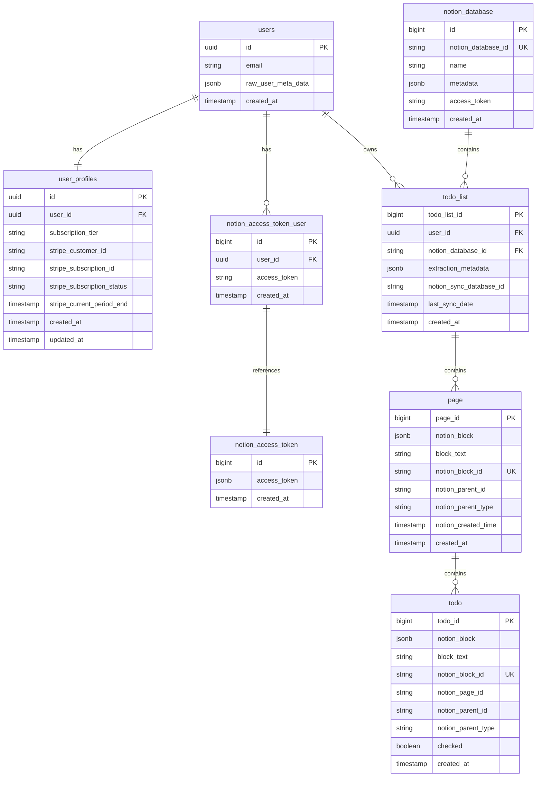

# Database Schema

This document provides a detailed overview of the Supabase database schema used in Checkify.so, including table structures, relationships, and data models.

## Overview

Checkify.so uses Supabase (PostgreSQL) as its database with the following architecture:
- **Authentication**: Managed by Supabase Auth (auth.users table)
- **Application Data**: Custom tables for Notion integration and todo management
- **Row Level Security (RLS)**: Ensures users can only access their own data

## Database Diagram



## Table Definitions

### 1. auth.users (Supabase Auth)

Managed by Supabase Auth - stores user authentication data.

| Column | Type | Description |
|--------|------|-------------|
| id | uuid | Primary key, user identifier |
| email | varchar | User's email address |
| encrypted_password | varchar | Hashed password (if using email auth) |
| raw_user_meta_data | jsonb | Additional user metadata |
| created_at | timestamp | Account creation timestamp |
| updated_at | timestamp | Last update timestamp |

### 2. user_profiles

Stores user profile data, subscription status, and billing information.

```sql
CREATE TABLE user_profiles (
    id UUID DEFAULT gen_random_uuid() PRIMARY KEY,
    user_id UUID NOT NULL REFERENCES auth.users(id) ON DELETE CASCADE,
    subscription_tier TEXT DEFAULT 'free',
    stripe_customer_id TEXT,
    stripe_subscription_id TEXT,
    stripe_subscription_status TEXT,
    stripe_current_period_end TIMESTAMP WITH TIME ZONE,
    created_at TIMESTAMP WITH TIME ZONE DEFAULT NOW(),
    updated_at TIMESTAMP WITH TIME ZONE DEFAULT NOW(),
    UNIQUE(user_id)
);

-- Index for user lookups
CREATE INDEX idx_user_profiles_user_id ON user_profiles(user_id);
```

**Columns:**
- `subscription_tier`: Current tier ('free', 'pro', 'max')
- `stripe_customer_id`: Stripe customer identifier
- `stripe_subscription_id`: Active subscription ID
- `stripe_subscription_status`: Status ('active', 'canceled', 'past_due', etc.)
- `stripe_current_period_end`: When current billing period ends

### 3. notion_access_token

Stores the raw OAuth response from Notion.

```sql
CREATE TABLE notion_access_token (
    id BIGSERIAL PRIMARY KEY,
    access_token JSONB NOT NULL,
    created_at TIMESTAMP WITH TIME ZONE DEFAULT NOW()
);
```

**Sample Data:**
```json
{
    "access_token": "secret_...",
    "token_type": "bearer",
    "bot_id": "...",
    "workspace_name": "My Workspace",
    "workspace_id": "...",
    "owner": {
        "type": "user",
        "user": {
            "id": "...",
            "name": "John Doe"
        }
    }
}
```

### 3. notion_access_token_user

Links users to their Notion access tokens.

```sql
CREATE TABLE notion_access_token_user (
    id BIGSERIAL PRIMARY KEY,
    user_id UUID NOT NULL REFERENCES auth.users(id) ON DELETE CASCADE,
    access_token VARCHAR NOT NULL,
    created_at TIMESTAMP WITH TIME ZONE DEFAULT NOW(),
    UNIQUE(user_id)
);

-- Index for fast lookups
CREATE INDEX idx_notion_token_user ON notion_access_token_user(user_id);
```

### 4. notion_database

Stores metadata about connected Notion databases.

```sql
CREATE TABLE notion_database (
    id BIGSERIAL PRIMARY KEY,
    notion_database_id VARCHAR NOT NULL UNIQUE,
    name VARCHAR,
    metadata JSONB,
    access_token VARCHAR,
    created_at TIMESTAMP WITH TIME ZONE DEFAULT NOW()
);

-- Index for database lookups
CREATE INDEX idx_notion_database_id ON notion_database(notion_database_id);
```

**Metadata Structure:**
```json
{
    "id": "database-uuid",
    "title": [{"plain_text": "My Tasks"}],
    "icon": {"type": "emoji", "emoji": "📝"},
    "properties": {
        "Name": {"id": "title", "type": "title"},
        "Status": {"id": "status", "type": "select"}
    }
}
```

### 5. todo_list

User's todo lists linked to Notion databases.

```sql
CREATE TABLE todo_list (
    todo_list_id BIGSERIAL PRIMARY KEY,
    user_id UUID NOT NULL REFERENCES auth.users(id) ON DELETE CASCADE,
    notion_database_id VARCHAR NOT NULL REFERENCES notion_database(notion_database_id),
    extraction_metadata JSONB,
    notion_sync_database_id TEXT,
    last_sync_date TIMESTAMP WITH TIME ZONE,
    created_at TIMESTAMP WITH TIME ZONE DEFAULT NOW(),
    UNIQUE(user_id, notion_database_id)
);

-- Indexes for queries
CREATE INDEX idx_todo_list_user ON todo_list(user_id);
CREATE INDEX idx_todo_list_database ON todo_list(notion_database_id);
```

### 6. page

Cached Notion pages containing todos.

```sql
CREATE TABLE page (
    page_id BIGSERIAL PRIMARY KEY,
    notion_block JSONB NOT NULL,
    block_text VARCHAR,
    notion_block_id VARCHAR NOT NULL UNIQUE,
    notion_parent_id VARCHAR,
    notion_parent_type VARCHAR,
    notion_created_time TIMESTAMP WITH TIME ZONE,
    created_at TIMESTAMP WITH TIME ZONE DEFAULT NOW()
);

-- Indexes for queries
CREATE INDEX idx_page_block_id ON page(notion_block_id);
CREATE INDEX idx_page_parent ON page(notion_parent_id);
```

**Notion Block Structure:**
```json
{
    "id": "page-uuid",
    "object": "page",
    "created_time": "2024-01-01T00:00:00.000Z",
    "last_edited_time": "2024-01-02T00:00:00.000Z",
    "parent": {
        "type": "database_id",
        "database_id": "database-uuid"
    },
    "properties": {
        "Name": {
            "title": [{"plain_text": "Project Alpha"}]
        }
    }
}
```

### 8. todo

Individual todo items from Notion blocks.

```sql
CREATE TABLE todo (
    todo_id BIGSERIAL PRIMARY KEY,
    notion_block JSONB NOT NULL,
    block_text VARCHAR,
    notion_block_id VARCHAR NOT NULL UNIQUE,
    notion_page_id VARCHAR,
    notion_parent_id VARCHAR,
    notion_parent_type VARCHAR,
    checked BOOLEAN DEFAULT FALSE,
    created_at TIMESTAMP WITH TIME ZONE DEFAULT NOW()
);

-- Indexes for queries
CREATE INDEX idx_todo_block_id ON todo(notion_block_id);
CREATE INDEX idx_todo_page ON todo(notion_page_id);
CREATE INDEX idx_todo_checked ON todo(checked);
```

**Todo Block Structure:**
```json
{
    "id": "block-uuid",
    "object": "block",
    "type": "to_do",
    "to_do": {
        "rich_text": [{"plain_text": "Complete design review"}],
        "checked": false,
        "color": "default"
    },
    "parent": {
        "type": "page_id",
        "page_id": "page-uuid"
    }
}
```

### 9. notion_sync_pages

Tracks synced Notion database pages and their original checkbox blocks. Used by the sync-to-Notion feature.

```sql
CREATE TABLE notion_sync_pages (
  id UUID DEFAULT gen_random_uuid() PRIMARY KEY,
  todo_list_id UUID NOT NULL REFERENCES todo_list(todo_list_id) ON DELETE CASCADE,
  sync_database_id TEXT NOT NULL,
  page_id TEXT NOT NULL,
  block_id TEXT NOT NULL,
  created_at TIMESTAMP WITH TIME ZONE DEFAULT NOW(),
  updated_at TIMESTAMP WITH TIME ZONE DEFAULT NOW(),
  UNIQUE(page_id)
);
```

**Columns:**
- `id`: Unique identifier
- `todo_list_id`: Reference to the todo list
- `sync_database_id`: Notion database ID where synced
- `page_id`: Notion page ID in the synced database
- `block_id`: Original checkbox block ID
- `created_at`: Creation timestamp
- `updated_at`: Last update timestamp

**Indexes:**
```sql
CREATE INDEX idx_sync_pages_page_id ON notion_sync_pages(page_id);
CREATE INDEX idx_sync_pages_todo_list ON notion_sync_pages(todo_list_id);
```

## Recent Schema Updates

### todo_list Table Updates (January 2025)
Added columns for extraction metadata and Notion sync support:

```sql
-- Migration: 20250122_add_todo_list_metadata.sql
ALTER TABLE todo_list
ADD COLUMN extraction_metadata JSONB,
ADD COLUMN notion_sync_database_id TEXT,
ADD COLUMN last_sync_date TIMESTAMP WITH TIME ZONE;
```

**New Columns:**
- `extraction_metadata`: JSONB field storing extraction details:
  ```json
  {
    "totalPages": 45,
    "totalCheckboxes": 120,
    "pagesWithTodos": 15,
    "errors": [],
    "tierLimits": {
      "maxPages": 100,
      "maxCheckboxesPerPage": 100
    }
  }
  ```
- `notion_sync_database_id`: ID of the created Notion sync database
- `last_sync_date`: Timestamp of last successful sync

### Planned: Webhook Support (Future)
Webhook columns will be added in a future migration:
```sql
-- Future migration
ALTER TABLE todo_list
ADD COLUMN webhook_id TEXT,
ADD COLUMN webhook_url TEXT,
ADD COLUMN webhook_secret TEXT;
```

## Relationships

### Foreign Key Constraints

1. **User Relationships**
   - `notion_access_token_user.user_id` → `auth.users.id`
   - `todo_list.user_id` → `auth.users.id`

2. **Notion Database Relationships**
   - `todo_list.notion_database_id` → `notion_database.notion_database_id`

3. **Cascade Deletes**
   - Deleting a user removes all their data
   - Deleting a database removes associated todo lists

### Data Integrity Rules

1. **Unique Constraints**
   - One Notion token per user
   - One todo list per user-database combination
   - Unique Notion IDs for pages and todos

2. **Not Null Constraints**
   - All foreign keys must be valid
   - Notion blocks must contain data
   - Timestamps are auto-generated

## Row Level Security (RLS)

### Enable RLS on Tables

```sql
-- Enable RLS
ALTER TABLE notion_access_token_user ENABLE ROW LEVEL SECURITY;
ALTER TABLE todo_list ENABLE ROW LEVEL SECURITY;

-- Policies for notion_access_token_user
CREATE POLICY "Users can view own token" ON notion_access_token_user
    FOR SELECT USING (auth.uid() = user_id);

CREATE POLICY "Users can insert own token" ON notion_access_token_user
    FOR INSERT WITH CHECK (auth.uid() = user_id);

-- Policies for todo_list
CREATE POLICY "Users can view own lists" ON todo_list
    FOR SELECT USING (auth.uid() = user_id);

CREATE POLICY "Users can create own lists" ON todo_list
    FOR INSERT WITH CHECK (auth.uid() = user_id);

CREATE POLICY "Users can delete own lists" ON todo_list
    FOR DELETE USING (auth.uid() = user_id);
```

## Query Patterns

### Common Queries

1. **Get User's Todo Lists**
```sql
SELECT 
    tl.todo_list_id,
    tl.created_at,
    nd.name,
    nd.metadata
FROM todo_list tl
JOIN notion_database nd ON tl.notion_database_id = nd.notion_database_id
WHERE tl.user_id = $1
ORDER BY tl.created_at DESC;
```

2. **Get Todos for a List**
```sql
SELECT 
    p.page_id,
    p.block_text as page_title,
    t.todo_id,
    t.block_text as todo_text,
    t.checked,
    t.notion_block_id
FROM page p
LEFT JOIN todo t ON p.notion_block_id = t.notion_page_id
WHERE p.notion_parent_id = $1
ORDER BY p.notion_created_time DESC, t.created_at ASC;
```

3. **Update Todo Checkbox**
```sql
UPDATE todo 
SET checked = $2
WHERE notion_block_id = $1
RETURNING *;
```

## Data Types & Conventions

### JSONB Usage

We use JSONB for storing Notion API responses because:
- Preserves the complete API response
- Allows querying JSON fields
- Flexible for API changes
- Efficient storage and indexing

### Timestamp Conventions

- All timestamps use `TIMESTAMP WITH TIME ZONE`
- `created_at` is auto-generated
- `notion_created_time` preserves Notion's timestamp

### String Identifiers

- Notion IDs are stored as VARCHAR
- UUIDs with hyphens removed
- Indexed for performance

## Migration Strategy

### Adding New Tables

```sql
-- Example: Add a table for shared lists
CREATE TABLE shared_todo_list (
    id BIGSERIAL PRIMARY KEY,
    todo_list_id BIGINT REFERENCES todo_list(todo_list_id),
    shared_with_email VARCHAR NOT NULL,
    permission VARCHAR CHECK (permission IN ('view', 'edit')),
    created_at TIMESTAMP WITH TIME ZONE DEFAULT NOW()
);
```

### Modifying Existing Tables

```sql
-- Example: Add a priority field
ALTER TABLE todo 
ADD COLUMN priority INTEGER DEFAULT 0;

-- Add index for new queries
CREATE INDEX idx_todo_priority ON todo(priority);
```

## Performance Optimization

### Indexes

Critical indexes for performance:
- User lookups: `user_id` on all user-owned tables
- Notion ID lookups: `notion_block_id`, `notion_database_id`
- Filtering: `checked` status on todos

### Query Optimization

1. **Use prepared statements**
2. **Batch inserts for bulk operations**
3. **Limit result sets with pagination**
4. **Use partial indexes for filtered queries**

### Maintenance

```sql
-- Vacuum and analyze regularly
VACUUM ANALYZE;

-- Monitor table sizes
SELECT 
    schemaname,
    tablename,
    pg_size_pretty(pg_total_relation_size(schemaname||'.'||tablename)) AS size
FROM pg_tables
WHERE schemaname = 'public'
ORDER BY pg_total_relation_size(schemaname||'.'||tablename) DESC;
```

## Backup & Recovery

### Backup Strategy

1. **Automated Backups**: Supabase handles daily backups
2. **Point-in-time Recovery**: Available on Pro plans
3. **Manual Exports**: Regular exports of critical data

### Disaster Recovery

```sql
-- Export schema
pg_dump -h localhost -U postgres -d your_db --schema-only > schema.sql

-- Export data
pg_dump -h localhost -U postgres -d your_db --data-only > data.sql
```

## Future Considerations

### Potential Schema Changes

1. **Collaboration Features**
   - Shared todo lists
   - Comments on todos
   - Activity tracking

2. **Performance Improvements**
   - Materialized views for complex queries
   - Partitioning for large tables
   - Read replicas for scaling

3. **Additional Features**
   - Tags and categories
   - Due dates and reminders
   - Attachments and links